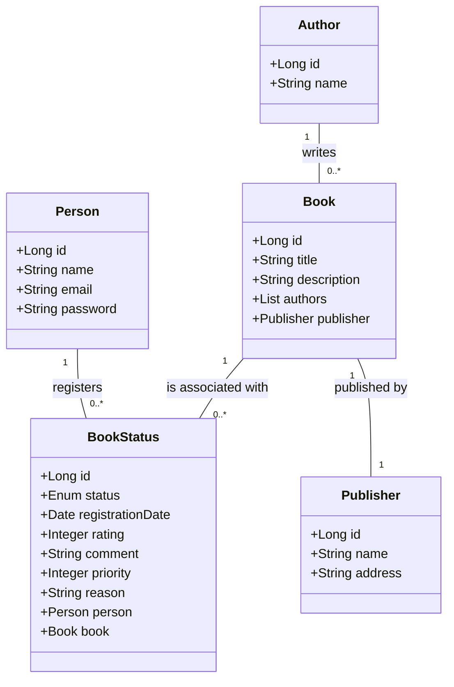

# Publicando Sua API REST na Nuvem Usando Spring Boot 3, Java 17 e Railway


### Descrição do Projeto
Neste projeto, desenvolvi uma API RESTful utilizando Java 17 e Spring Boot 3 para uma biblioteca, com integração a banco de dados via Spring Data JPA. O objetivo foi criar uma aplicação simples e funcional, com endpoints bem definidos para gerenciar recursos específicos. A API foi implementada com o foco em boas práticas de desenvolvimento e documentação.

Após a criação da API, o próximo passo foi realizar o deploy na nuvem utilizando a plataforma Railway, que facilitou o processo de disponibilização da aplicação sem a necessidade de configurações complexas.

## ⛏️ Tecnologias utilizadas (Pré-requisitos): 
- Java 17
- Spring Boot 3
- Spring Data JPA
- Swagger/OpenAPI
- Railway (para Deploy na Nuvem)

## Figma para Abstração de Domínio

O Figma foi utilizado para a abstração do domínio desta API, sendo essencial na análise e projeto da solução. A ferramenta ajudou a mapear as entidades e a estrutura de dados, garantindo uma visão clara da arquitetura e das interações entre os componentes da aplicação.

### Diagrama de Classes (Domínio da API)
A seguir, você encontrará o Diagrama de Classes, que ilustra a estrutura do domínio da API, as entidades envolvidas e os relacionamentos entre elas.



### Capturas de Tela da Execução do Projeto

Aqui estão algumas capturas de tela que ilustram o funcionamento da API e a documentação gerada via Swagger/OpenAPI:

#### Tela 1: Visualização dos Endpoints da API no Swagger

#### Tela 2: Executando uma Requisição POST para Criar um Novo Recurso

#### Tela 3: Resultado da Requisição GET para Listar Recursos

### Objetivos do Projeto:
- Criar uma API RESTful que seja capaz de receber requisições HTTP e interagir com o banco de dados.
- Garantir uma documentação clara da API, facilitando o uso e entendimento dos endpoints.
- Implementar a aplicação na nuvem, permitindo acesso remoto à API de qualquer lugar.

#  ⚙️ Como Rodar o Projeto Localmente:  <a name = "tinstall"></a>
### Pré-requisitos
```
Java 17
Spring Boot 3
Spring Data JPA
Swagger/OpenAPI
Railway (para Deploy na Nuvem)
```
### Instalação
#### 1 - Clone este repositório:
```
git clone https://github.com/viniciosmucheirone/DIO-Decola-Tech2025.git
```
#### 2 - Navegue até o diretório do projeto:
```
cd DIO-Decola-Tech2025/Biblioteca-API/
```
#### 3 - Abra o projeto em sua IDE favorita (como IntelliJ IDEA ou Eclipse).

#### 4 - Configure seu banco de dados (pode ser um banco de dados MySQL, PostgreSQL ou qualquer outro de sua escolha).

#### 5 - Execute o projeto com o comando:
```
./mvnw spring-boot:run
```
Agora, sua API estará rodando localmente e você pode começar a fazer requisições aos seus endpoints.
###  Conclusão:
Este projeto foi uma excelente oportunidade para aplicar os conceitos aprendidos no bootcamp Decola Tech Avanade 2025. A criação e o deploy de uma API RESTful na nuvem são habilidades essenciais para qualquer desenvolvedor full-stack, e agora, com o deploy no Railway, a API está acessível online, pronta para ser consumida por outras aplicações.