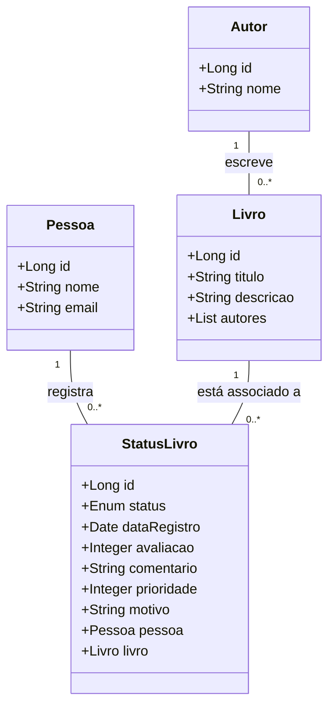

# Digital_Library_SpringBoot

```mermaid
classDiagram
    class Pessoa {
        +Long id
        +String nome
        +String email
    }

    class Autor {
        +Long id
        +String nome
    }

    class Livro {
        +Long id
        +String titulo
        +String descricao
        +List<Autor> autores
    }

    class StatusLivro {
        +Long id
        +Enum status
        +Date dataRegistro
        +Integer avaliacao
        +String comentario
        +Integer prioridade
        +String motivo
        +Pessoa pessoa
        +Livro livro
    }

    Pessoa "1" -- "0..*" StatusLivro : registra
    Livro "1" -- "0..*" StatusLivro : está associado a
    Autor "1" -- "0..*" Livro : escreve
```
