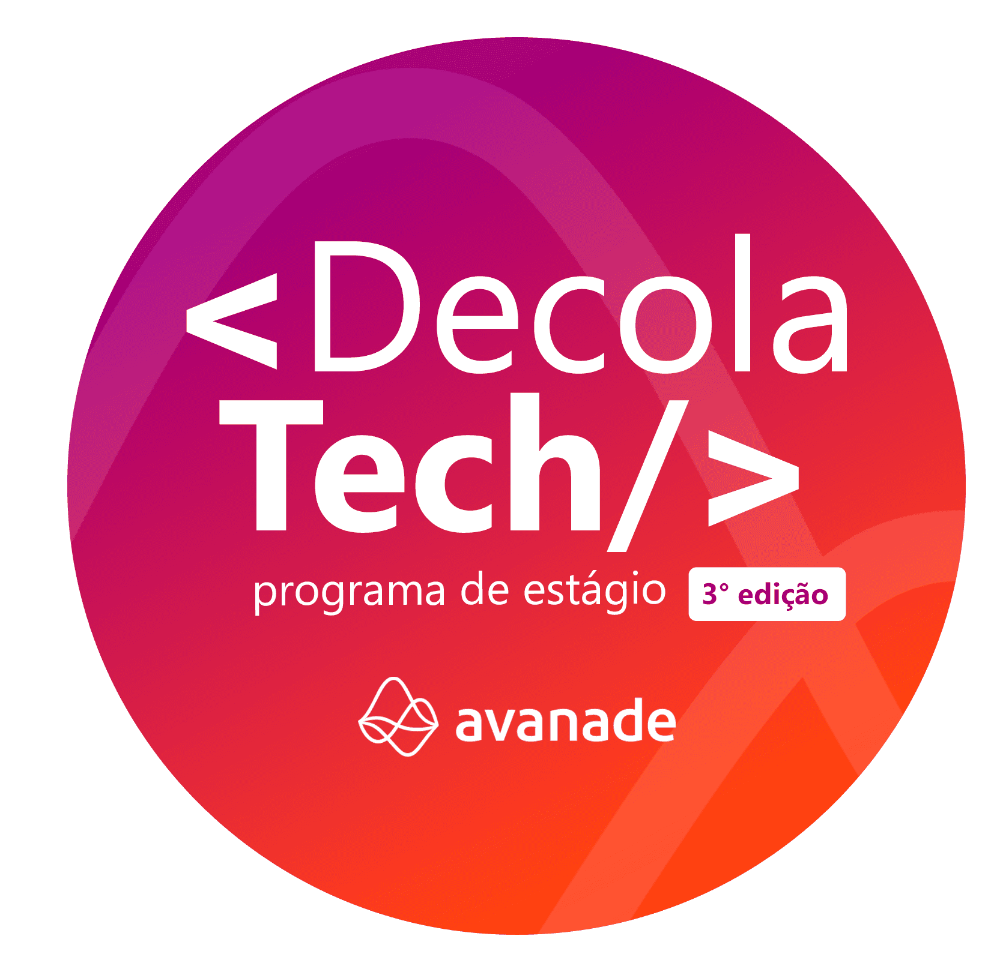
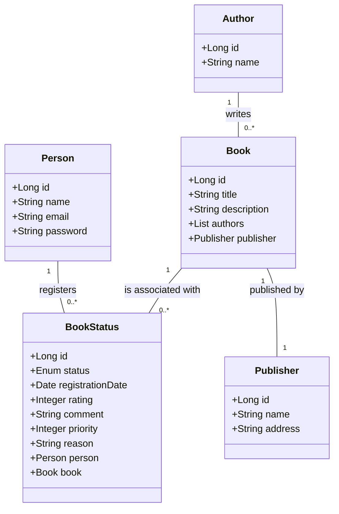

<h1 align="center">
    
</h1>

Este repositório é utilizado para o bootcamp DeCola Tech Avanade para a criação de uma API REST Documentada com Spring Web e Swagger.

# API REST na Nuvem Usando Spring Boot 3, Java 17 e Railway

  <a href="#authors">Autor</a>&nbsp;&nbsp;&nbsp;|&nbsp;&nbsp;&nbsp;
  <a href="#about">Sobre</a>&nbsp;&nbsp;&nbsp;|&nbsp;&nbsp;&nbsp;
  <a href="#tech_utilizadas">Tecnologias utilizadas</a>&nbsp;&nbsp;&nbsp;|&nbsp;&nbsp;&nbsp;
  <a href="#installd">Tecnologias utilizadas</a>&nbsp;&nbsp;&nbsp;|&nbsp;&nbsp;&nbsp;
  <a href="#app">Acesso à aplicação</a>&nbsp;&nbsp;&nbsp;|&nbsp;&nbsp;&nbsp;
  <a href="#app">Planejamento</a>

### Fluxograma

