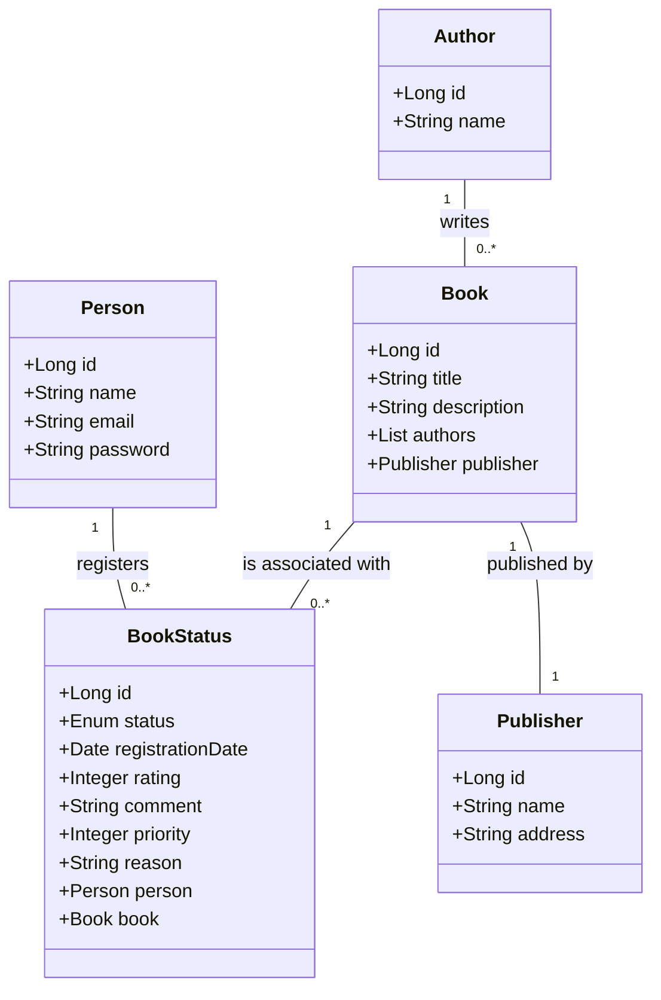

# O PROJETO Digital_Library_SpringBoot Criando uma API REST Documentada com Spring Web e Swagger
## Fluxograma

```mermaid
classDiagram
    class Person {
        +Long id
        +String name
        +String email
        +String password
    }

    class Author {
        +Long id
        +String name
    }

    class Publisher {
        +Long id
        +String name
        +String address
    }

    class Book {
        +Long id
        +String title
        +String description
        +List<Author> authors
        +Publisher publisher
    }

    class BookStatus {
        +Long id
        +Enum status
        +Date registrationDate
        +Integer rating
        +String comment
        +Integer priority
        +String reason
        +Person person
        +Book book
    }

    Person "1" -- "0..*" BookStatus : registers
    Book "1" -- "0..*" BookStatus : is associated with
    Author "1" -- "0..*" Book : writes
    Book "1" -- "1" Publisher : published by


```
